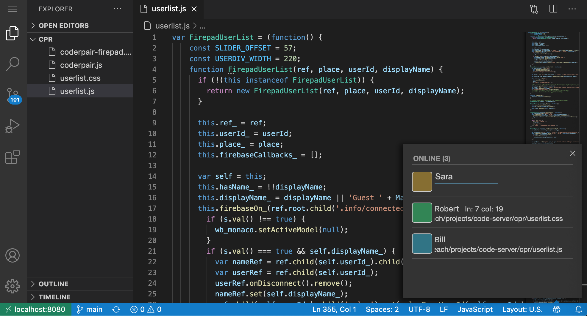

# Coderpair vscode-live

Run [VS Code](https://github.com/Microsoft/vscode) on any machine anywhere and access it in the browser.

Set up multiple user accounts. Each user may have their own preferences/settings.

Collaborate with your team in real time.


*Use the group icon in the statusbar to open the user list.

## Getting Started

This is an extension of [code-server's](https://github.com/cdr/code-server) release of vscode.

Almost all the info that you need can be found on the [code-server](https://github.com/cdr/code-server) page. The only thing that will be covered here are the differences.

## Installing

Get the latest release [here](https://github.com/coderpair/vscode-live/releases). Go to the code-server [installation](https://github.com/cdr/code-server/blob/v3.7.3/doc/install.md) page. Refer to the instructions for manual installation for your particular environment.

## Setup

Run code-server according to the instructions in the installation page above and point your browser to the url of your code-server installation. If everything looks OK, you are ready to start setting up vscode-live.

When `code-server` starts up, it creates a default config file in `~/.config/code-server/config.yaml` that looks
like this:

```yaml
bind-addr: 127.0.0.1:8080
auth: password
password: mewkmdasosafuio3422 # This is randomly generated for each config.yaml
admin: osdifnasdfiopsdfn3556 # This is randomly generated for each config.yaml
cert: false
```

The `password` field is what you use to log in to code-server as the default user. 

`admin` is a secondary password that you use for making changed through the dashboard.

## Setting up Firebase
You will need a Firebase account to use the real time collaboration feature. You can [sign up here for a free account](https://console.firebase.google.com/).

After signing up, edit the `config.yaml` so that it looks like this:

```yaml
bind-addr: 127.0.0.1:8080
auth: password
password: mewkmdasosafuio3422 # This is randomly generated for each config.yaml
admin: osdifnasdfiopsdfn3556 # This is randomly generated for each config.yaml
cert: false
firebase-apiKey: '<API_KEY>'
firebase-authDomain: '<DATABASE_NAME>.firebaseapp.com'
firebase-databaseURL: 'https://<DATABASE_NAME>.firebaseio.com'
firebase-ref: '-MCyz2LOkxQUSJBASlcG'
```

Fill in the `<API_KEY>` and `<DATABASE_NAME>` with your Firebase settings. You can leave the `firebase-ref` field as is or change it if you feel like it! Restart code-server for the changes to go into effect.

Skip to [Turning on real time collaboration](#turning-on-real-time-collaboration) if you don't want to set up multiple accounts.

## Setting up multiple accounts

You can set up an account for each of your team members. Each user will be able to use vscode-live with their own default settings.

In order to set up multiple accounts, add a `users` field to the  `config.yaml` file so that it looks like this:

```yaml
bind-addr: 127.0.0.1:8080
auth: password
password: mewkmdasosafuio3422 # This is randomly generated for each config.yaml
admin: osdifnasdfiopsdfn3556 # This is randomly generated for each config.yaml
cert: false
firebase-apiKey: '<API_KEY>'
firebase-authDomain: '<DATABASE_NAME>.firebaseapp.com'
firebase-databaseURL: 'https://<DATABASE_NAME>.firebaseio.com'
firebase-ref: '-MCyz2LOkxQUSJBASlcG'
users: {
  robert: {password: pswd1, role: admin},
  sara: {password: pswd2, role: user}
  leonardo: {password: pswd3, role: user}
}
```

Restart code-server for the changes to go into effect.

You can add as many accounts as you like. You will log in to code-server with password you specify, so make sure it is a secure password.

Go to the login page in your browser

ie http://localhost:8080/login  

and sign in with one of the user accounts.

## Turning on real time collaboration

Head over to the dashboard:

ie http://localhost:8080/dashboard  

go to the real time collaboration section, and turn it on there. Make sure you use the `admin` password in the config file to make changes.

Have fun!


